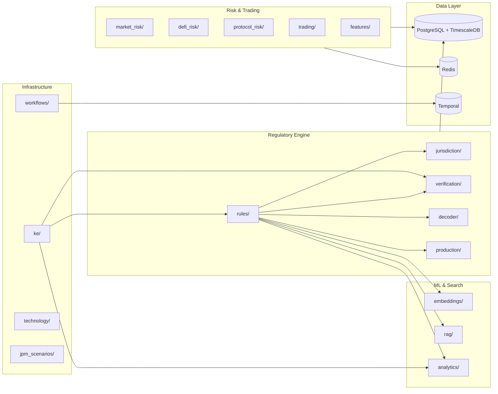

# Institutional DeFi Platform API

Unified backend for institutional digital asset compliance, risk analytics, and regulatory decision support. Merges regulatory rule execution, multi-jurisdiction navigation, risk quantification, and ML-powered explanations into a single domain-organized FastAPI service.

## Features

| Domain | What it does |
|--------|-------------|
| **Rule Engine** | YAML-encoded decision trees with traceable legal citations across 7 jurisdictions |
| **Jurisdiction Navigator** | Cross-border compliance pathways with conflict detection and equivalence mapping |
| **Decision Decoder** | Template-based + LLM-powered explanations anchored to legal sources |
| **Verification** | 5-tier consistency checking (schema, semantic, NLI, cross-rule, human review) |
| **Embeddings** | 4-type vector embeddings (semantic, structural, entity, legal) + graph-based similarity |
| **RAG** | BM25 retrieval over legal corpus (MiCA, DLT Pilot, GENIUS Act) |
| **Analytics** | Rule clustering, coverage gaps, drift detection, error pattern analysis |
| **Market Risk** | VaR/CVaR, stress testing, correlation analysis |
| **DeFi Risk** | Protocol scoring, tokenomics analysis |
| **Trading** | Exposure, PnL, funding rate monitoring |
| **Feature Store** | TimescaleDB-backed risk feature snapshots with time-travel queries |
| **JPM Scenarios** | Pre-/post-trade scenario evaluation with memo generation |
| **Workflows** | Temporal-orchestrated compliance checks, verification runs, drift detection |

## Architecture



## Quick Start

```bash
# Start infrastructure
docker-compose up -d

# Install and run
pip install -e ".[dev]"
uvicorn src.main:app --reload

# Verify
curl http://localhost:8000/health
```

API docs at [localhost:8000/docs](http://localhost:8000/docs) (when `DEBUG=true`).

## Project Structure

```
src/
├── main.py                    # App factory, router registration, middleware
├── config.py                  # Settings(BaseSettings), env loading
├── database.py                # PostgreSQL + TimescaleDB, session DI
├── models.py                  # CustomBaseModel
├── exceptions.py              # Exception hierarchy + HTTP factories
├── ontology/                  # Shared types: jurisdiction, instrument, scenario
├── middleware/                # Audit logging, security headers, API key auth
├── telemetry/                 # OpenTelemetry tracing, Prometheus metrics, structlog
├── rules/                     # Rule engine, decision engine, YAML rule packs
├── verification/              # 5-tier consistency engine
├── analytics/                 # Drift detection, error patterns, visualization
├── decoder/                   # Template + LLM explanations, counterfactual engine
├── rag/                       # BM25 legal corpus retrieval
├── embeddings/                # 4-type + graph embeddings, vector search
├── jurisdiction/              # Navigation, conflicts, pathway synthesis, compliance
├── market_risk/               # VaR, stress testing, correlation
├── defi_risk/                 # Protocol scoring, tokenomics, research
├── token_compliance/          # Howey test, GENIUS Act analysis
├── protocol_risk/             # Blockchain protocol risk profiles
├── trading/                   # Exposure, PnL, funding rates
├── technology/                # Chain/RPC health monitoring
├── features/                  # TimescaleDB feature store
├── jpm_scenarios/             # Institutional scenario evaluation
├── workflows/                 # Temporal workflow orchestration
├── production/                # Compiled IR execution, premise indexing
└── ke/                        # Knowledge engineering workbench
```

## API Endpoints

| Prefix | Domain | Key Endpoints |
|--------|--------|---------------|
| `/rules` | Rule Engine | CRUD, search, bulk operations |
| `/decide` | Decision | Evaluate rules against scenarios |
| `/navigate` | Jurisdiction | Cross-border compliance navigation |
| `/compliance` | Compliance | Jurisdiction info, sanctions screening |
| `/verification` | Verification | Tier 0-4 consistency checks |
| `/decoder` | Decoder | Tiered explanations with citations |
| `/counterfactual` | What-If | Scenario comparison with delta analysis |
| `/qa` | RAG | Legal corpus Q&A |
| `/embedding/rules` | Embeddings | Vector similarity search |
| `/analytics` | Analytics | Clustering, coverage, conflicts |
| `/risk` | Market Risk | VaR, CVaR, liquidity metrics |
| `/quant` | Quant | Stress testing, correlation |
| `/defi-risk` | DeFi Risk | Protocol risk scoring |
| `/research` | Research | Tokenomics, protocol analysis |
| `/trading` | Trading | Exposure, PnL, funding |
| `/technology` | Technology | Chain status, RPC health |
| `/features` | Feature Store | Risk feature snapshots |
| `/jpm` | JPM Scenarios | Scenario runs, memo generation |
| `/workflows` | Workflows | Temporal workflow management |
| `/v2` | Production | Compiled rule evaluation |
| `/ke` | KE Workbench | Orchestrated rule management |

## Jurisdictions

| Code | Region | Framework | Status |
|------|--------|-----------|--------|
| EU | European Union | MiCA (2023/1114) | Enacted |
| UK | United Kingdom | FCA Crypto (COBS 4.12A) | Enacted |
| US | United States | GENIUS Act / SEC / CFTC | Enacted |
| CH | Switzerland | DLT Act 2021 | Enacted |
| SG | Singapore | PSA 2019 | Enacted |
| HK | Hong Kong | VASP Regime 2023 | Enacted |
| JP | Japan | Payment Services Act 2023 | Enacted |

## Tech Stack

| Layer | Technology |
|-------|-----------|
| API | FastAPI + Pydantic v2 |
| ORM | SQLModel + SQLAlchemy 2.0 |
| Database | PostgreSQL 16 + TimescaleDB |
| Migrations | Alembic |
| Search | BM25 (rank-bm25) + optional vector (sentence-transformers) |
| Workflows | Temporal |
| Cache/Queue | Redis + Celery |
| LLM | Anthropic Claude (optional) |
| Blockchain | web3.py (optional) |
| Observability | OpenTelemetry, Prometheus, structlog |
| Linting | Ruff |

## Development

```bash
# Install with dev tools
pip install -e ".[dev]"

# Run tests
pytest tests/ -x

# Lint and format
ruff check src tests
ruff format src tests

# Database migrations
alembic upgrade head
```

### Optional Dependencies

Install only what you need:

```bash
pip install -e ".[ml]"          # sentence-transformers, chromadb
pip install -e ".[llm]"         # anthropic SDK
pip install -e ".[blockchain]"  # web3
pip install -e ".[temporal]"    # temporalio
pip install -e ".[telemetry]"   # opentelemetry, prometheus
pip install -e ".[all]"         # everything
```

### Docker

```bash
# Full stack
docker-compose up -d

# Services: PostgreSQL+TimescaleDB (:5432), Redis (:6379), Temporal (:7233), Temporal UI (:8233)
```

## Configuration

Copy `.env.example` to `.env`. Key variables:

| Variable | Default | Purpose |
|----------|---------|---------|
| `DATABASE_URL` | `postgresql://...localhost:5432/institutional_defi` | PostgreSQL connection |
| `REDIS_URL` | `redis://localhost:6379/0` | Cache and task queue |
| `ENVIRONMENT` | `local` | `local`, `staging`, `production` |
| `DEBUG` | `true` | Enables `/docs` and `/redoc` |
| `ANTHROPIC_API_KEY` | — | LLM decoder (optional) |
| `TEMPORAL_HOST` | — | Temporal server (optional) |
| `ENABLE_FEATURE_STORE` | `false` | TimescaleDB feature store |

## CI/CD Pipeline

### Continuous Integration

Every push and pull request runs the CI workflow (`.github/workflows/ci.yml`):

1. **Lint** — Ruff check and format verification
2. **Test** — Full test suite against PostgreSQL 16 (457 tests)
3. **Build** — Docker image build validation for both API and worker

### Continuous Deployment

| Workflow | Trigger | Target | Key Features |
|----------|---------|--------|-------------|
| `cd-staging.yml` | Push to `main` | Dev namespace | Auto build/push to ECR, Trivy scan, deploy, smoke test, Slack notify |
| `cd-production.yml` | Manual (`vX.Y.Z` tag) | Prod namespace | Semver validation, GitHub environment approval gate, auto-rollback on failure, GitHub Release creation |
| `security-scan.yml` | Weekly + manual | N/A | pip-audit, Bandit + Semgrep SAST, Gitleaks, Trivy container scan, Checkov IaC scan |

Required GitHub secrets: `AWS_ACCOUNT_ID`, `AWS_CD_ROLE_ARN`, `SLACK_WEBHOOK_URL`

### Production Deploy

```bash
# Tag a release
git tag v1.0.0 && git push origin v1.0.0

# Trigger production deploy (requires environment approval)
gh workflow run cd-production.yml -f image_tag=v1.0.0
```

## EKS Deployment

Infrastructure is defined as code across two directories:

| Directory | Contents |
|-----------|----------|
| `terraform/` | AWS infrastructure — VPC (3-AZ), EKS cluster, RDS (app + Temporal), ElastiCache Redis, ECR, IRSA roles, Secrets Manager |
| `kube/` | Kubernetes manifests — Kustomize base + overlays (local/dev/prod), PodDisruptionBudgets, ClusterSecretStore, Temporal Helm values |

### Architecture

```
┌─────────────┐     ┌──────────────┐     ┌──────────────┐
│   GitHub     │────▶│  ECR         │────▶│  EKS Cluster │
│   Actions    │     │  (api/worker)│     │              │
└─────────────┘     └──────────────┘     │  ┌────────┐  │
                                          │  │ API    │  │
                                          │  │ pods   │──┼──▶ ALB ──▶ Internet
                                          │  └────────┘  │
                                          │  ┌────────┐  │
                                          │  │ Worker │  │
                                          │  │ pods   │──┼──▶ Temporal
                                          │  └────────┘  │
                                          └──────┬───────┘
                                                 │
                              ┌───────────┬──────┴──────┐
                              ▼           ▼             ▼
                         ┌────────┐  ┌────────┐  ┌──────────┐
                         │  RDS   │  │  RDS   │  │ElastiCache│
                         │  App   │  │Temporal│  │  Redis    │
                         └────────┘  └────────┘  └──────────┘
```

### Environment Overlays

| Overlay | Namespace | Replicas | Images | Secrets |
|---------|-----------|----------|--------|---------|
| `local` | `institutional-defi` | 1 each | Local tags | Inline Kubernetes secrets |
| `dev` | `institutional-defi-dev` | 1 each | ECR `:latest` | ExternalSecret → AWS Secrets Manager |
| `prod` | `institutional-defi` | 3 API / 2 worker | ECR `:vX.Y.Z` | ExternalSecret → AWS Secrets Manager |

### Quick Start (EKS)

```bash
# 1. Provision infrastructure
cd terraform
terraform init
terraform apply -var-file=envs/dev.tfvars \
  -var="app_db_password=..." -var="temporal_db_password=..."

# 2. Bootstrap cluster (ALB controller, ESO, ClusterSecretStore)
# 3. Deploy Temporal via Helm
# 4. Push to main → auto-deploys to dev
```

Full walkthrough: [`docs/eks-deployment.md`](docs/eks-deployment.md)

### Cost Estimate

| Environment | Monthly Cost |
|-------------|-------------|
| Dev (single NAT, smaller instances) | ~$200-250 |
| Production (3-AZ NAT, HA, multi-AZ RDS) | ~$400-430 |

## Disclaimer

Research project. Not legal or financial advice. Regulatory rules are interpretive models — consult qualified counsel for compliance decisions.

## License

MIT

---

Built with [Claude Code](https://claude.ai/code)
